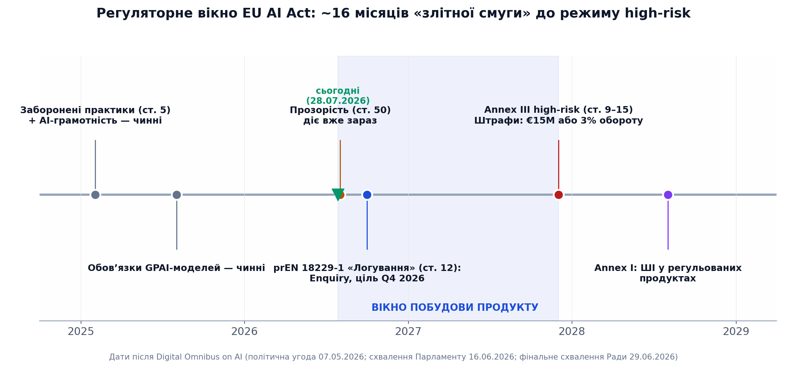
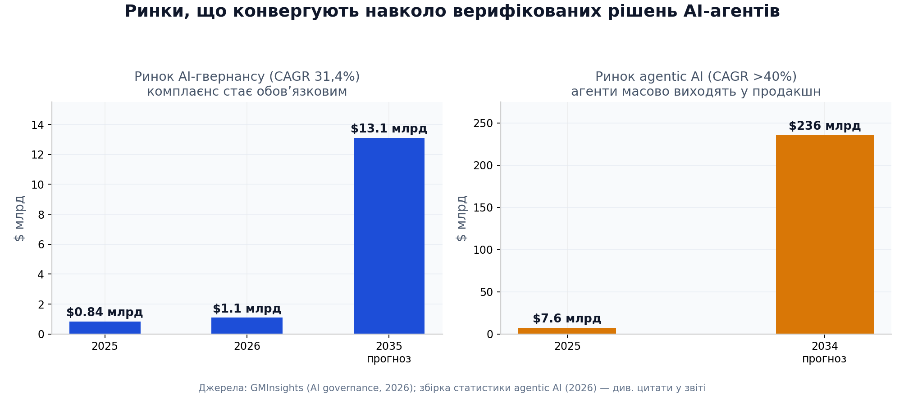
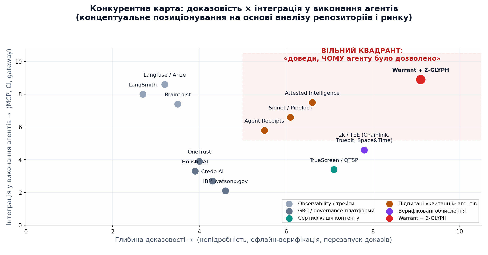
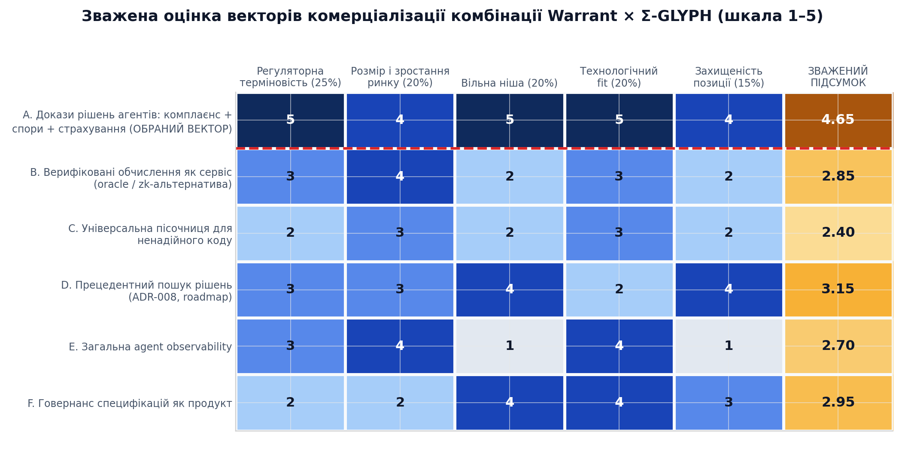
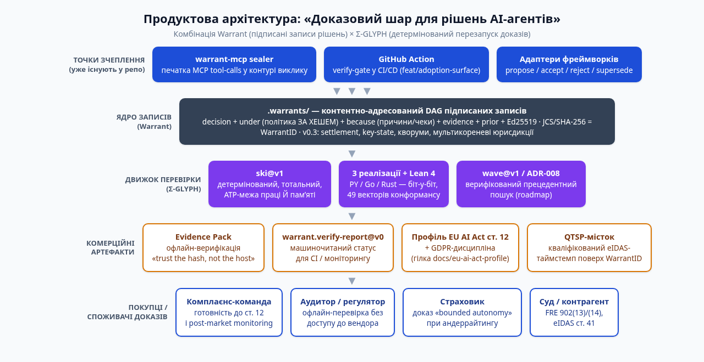

# Найкраще комерційне застосування комбінації Warrant × Σ-GLYPH

*Дип-ресерч за станом на 28 липня 2026 р. Аналіз охоплює `master` та всі функціональні гілки обох репозиторіїв (`s0fractal/warrant`: 12 гілок; `s0fractal/sigma-glyph`: 7 гілок), включаючи незмерджені напрацювання: профіль EU AI Act (гілка `docs/eu-ai-act-profile`), MCP-інтеграцію та Evidence Pack (`feat/package-and-evidence-pack`), adoption-surface з GitHub Action (`feat/adoption-surface`), специфікацію wave-runtime WRT-001 (`wrt-001-budget-spec`), key-state WRT-002 (`feat/wrt-002-keystate-r1`) та ADR-008 «Resonant Precedent» (гілка `adr-008-rev15-candidate`).*

---

## Відповідь коротко (TL;DR)

**Найкраще комерційне застосування — «доказовий шар для рішень AI-агентів» (Agent Decision Evidence-as-a-Service): продукт, який у момент кожного рішення агента (approve/reject/escalate, tool-call через MCP) записує криптографічно підписаний, хеш-адресований Warrant-запис із закріпленою за хешем політикою та перезапускним Σ-GLYPH-доказом, і пакує це в офлайн-верифіковані Evidence Pack'и для трьох платоспроможних споживачів: (1) комплаєнс-команд, які до 2 грудня 2027 р. мають виконати статтю 12 EU AI Act; (2) страховиків, що андеррайтять ризики agentic AI і вимагають доказу «bounded autonomy»; (3) сторін судових спорів про дії AI-агентів (прецедент Air Canada, FRE 902(13)/(14), eIDAS).** Це єдиний вектор, де комбінація технологій незамінна: observability-інструменти дають трейси, GRC-платформи — документацію, «квитанційні» проєкти — підпис, але ніхто не дає **перезапуск доказу будь-ким без довіри до автора** (ski@v1) разом із **settlement-семантикою і кворумами** (Warrant v0.3). Зважена оцінка шести векторів: **4,65 / 5** проти 3,15 у найближчого конкурента-вектора.

---

## 1. Технологічний інвентар: що реально є в репозиторіях

### 1.1. Warrant — підписані записи рішень із settlement-семантикою

Warrant — це формат і протокол «ордерів на рішення»: коли AI-агент щось приймає, відхиляє або пропонує, він записує маленький JSON-документ, що фіксує **що** вирішено, **за якою** політикою (поле `under` — хеші точних байтів політики), **чому** (поле `because` — проза або виконувані чеки), на підставі **яких** доказів, підписаний актором (Ed25519) і адресований власним SHA-256-хешем (WarrantID). Записи утворюють DAG через поле `prior`, а відхилення (`reject`) є першокласним записом — «ні, тому що» переживає самого агента і не може бути тихо відредаговано: зміна одного байта ламає кожне подальше посилання за хешем. Це принципово відрізняє формат від логів: трейс каже, що агент зробив, а warrant доводить, **чому йому було дозволено**, і доказ переживає вендора.

Критично важливі для комерціалізації властивості, підтверджені кодом у `master`: три незалежні реалізації (Python `impl/warrant.py`, ~1760 рядків; Go; Rust із власним Ed25519-верифікатором з нуля), які біт-у-біт згодні щодо кожного WarrantID і кожного результату верифікації — дизайн-правило SPEC прямо забороняє все, що не може досягти цієї згоди. Версія v0.3 додає **settlement-семантику** (рішення «осідають» і не можуть бути пересуджені без нових доказів), **key-state** (ротація і відкликання ключів — теж warrants; порогові політики кворуму 2-з-3) і **мультикореневі сховища** (окремі юрисдикції в одному blob-store). Машиночитаний `warrant.verify-report@v0` зі схемою «закритого» типу дозволяє CI-системам гейтити релізи на результаті верифікації, а `--store-mode` fail-closed поведінка робить `.ok` безпечним предикатом.

Гілки додають саме комерційну інфраструктуру. `feat/package-and-evidence-pack` приносить **Evidence Pack** — портативний, самоверифікований пакет рішення (записи + точні байти політики + перезапускні причини), який незнайомець перевіряє офлайн, не довіряючи нікому, крім вихідного коду верифікатора («trust the hash, not the host»), та **warrant-mcp** — sealer для MCP tool-calls, що працює в контурі виклику, а не постфактум. `feat/adoption-surface` містить готову **GitHub Action** (`action.yml`, 160 рядків) і скрипти реліз-паків — це готовий дистрибуційний канал. Гілка `docs/eu-ai-act-profile` містить повний інженерний мепінг полів формату на **статтю 12 EU AI Act** (record-keeping) із чесним GDPR-розділом: персональні дані — лише за хешем evidence, тіло запису — публічно цитоване назавжди. Демо `demos/air-canada/` відтворює справу Moffatt v. Air Canada як «запис, якого у авіакомпанії не було» — готовий продаж-нарратив.

### 1.2. Σ-GLYPH — детерміноване обчислювальне ядро з доведеними властивостями

Σ-GLYPH — контентно-адресоване SKI-обчислювальне ядро: `result_hash = eval(term_hash, atp)` — детерміноване, лише на цілих числах, **тотальне** (жоден вхід не зациклюється і не розходиться між реалізаціями). Його ключова властивість — **size-priced ATP**: бюджет `atp` обмежує одночасно роботу Й пікову пам'ять (інваріант `materialized size − 1 ≤ spent`), тому перезапуск чужого обчислення на власній машині безпечний за конструкцією — цього не можна сказати про перезапуск чужого shell-скрипта. Тотальність, детермінізм і межа пам'яті — не проза, а машинно-перевірені теореми Lean 4 (`proofs/EvalMachine.lean`), а три реалізації (Python-оракул, Go-евалюатор у складі warrant-go, Rust з нуля із власним SHA-256) згодні на всіх **49 векторах конформансу**, плюс диференційний фазер на кожен push.

Поверх ядра — дві навігаційні Книги. Book II визначає «хвильові» координати (WaveVectorQ) як обчислювану, не навчену проєкцію термів — координата виводиться байт-точно, а не тренується, як embedding. Book III — федерація анотацій як **профіль Warrant v0.3**: твердження про хвилі є warrant-записами, юрисдикції застосовують машиночитані selection-політики, розбіжність юрисдикцій постійна і за задумом (жодних прихованих глобальних консенсусів). Гілка `adr-008-rev15-candidate` містить ADR-008 «Resonant Precedent» (15 ревізій після серії гейтів) разом із warrant-ським компаньйоном WRT-001 (гілка `wrt-001-budget-spec`): новий чек-рантайм `sigma-glyph.wave@v1`, що дозволяє warrant-запису цитувати попереднє рішення як **прецедент** з машинно-перевірюваним твердженням «проєкція рішення X когерентна запиту Q за юрисдикцією J». Це ще PROPOSED (чекає 3-сімейного гейту і key-state R1), але це пряма дорожня карта до верифікованого прецедентного пошуку — речей, які векторні БД структурно дати не можуть, бо їхня близькість не є ні відтворюваною, ні оспорюваною.

### 1.3. Зведена таблиця активів за гілками

| Актив | Де лежить | Статус | Комерційне значення |
|---|---|---|---|
| Формат Warrant v0.1–v0.3, SPEC із тест-векторами | `master` (SPEC.md) | DRAFT, стабільний | Стандарт запису рішень; «нудний задумано» — реалізовний за день |
| 3 реалізації (PY/Go/RS) + диференційні тести | `master` (impl*, tests/) | Працює, conformance ALL PASS | Незалежна верифікація — аргумент для аудиторів і судів |
| ski@v1 рантайм (Σ-GLYPH Book I v0.5 вбудовано) | `master` + sigma-glyph Book I | Працює, 49/49 векторів | Перезапуск доказу без довіри — унікальна властивість |
| Evidence Pack v0 + warrant-mcp sealer | `feat/package-and-evidence-pack` | Незмерджено, тести є | Готовий SKU: «доказ у справі» + інтеграція в MCP-контур |
| GitHub Action + реліз-паки | `feat/adoption-surface` | Незмерджено | Канал дистрибуції: verify-gate у CI |
| Профіль EU AI Act ст. 12 (+GDPR) | `docs/eu-ai-act-profile` | DRAFT, non-normative | Готовий compliance-нарратив з датованою верифікацією |
| Settlement / key-state / кворуми (v0.3) | `master` §5.1/§7/§9 + `feat/wrt-002-keystate-r1` | DRAFT, гейти 3 сімей | Мульти-акторні юрисдикції — B2B-аргумент |
| Демо Air Canada | `master` (demos/) | Працює офлайн | Продаж через впізнаваний прецедент |
| wave@v1 / ADR-008 прецедентний пошук | `wrt-001-budget-spec` + `adr-008-rev15-candidate` | PROPOSED (rev 15) | Roadmap-диференціація: верифікований retrieval |
| Говернанс специфікацій (GOV-anchors, ADR-007) | sigma-glyph `master` | STANDARD | Показовий кейс самоприміщення: релізи спеки приймаються warrants 2-з-3 |

### 1.4. Чому саме комбінація, а не кожен репозиторій окремо

Окремо Warrant — це ще один підписаний журнал із гарною схемою; таких на ринку вже декілька (див. розділ 4). Окремо Σ-GLYPH — це академічно блискуче, але вузьковиразне обчислювальне ядро: SKI-комбінатори з ATP-ціноутворенням вирішують проблему «безпечно перезапустити чуже обчислення», яка у більшості інженерів просто не болить. Разом вони утворюють **замкнений контур доказу**: Warrant каже, що треба довести (рішення, політика, причини), Σ-GLYPH робить причину перезапускною будь-ким (ski@v1-чек — це контентно-адресований SKI-терм, чий вердикт — порівняння хешів), а v0.3-settlement робить результат фінальним і кворумним. Саме цей контур — а не будь-яка з частин — відповідає на запит, який одночасно ставлять регулятор (ст. 12 EU AI Act), страховик (bounded autonomy) і суд (доказ з належною автентифікацією).

Друга синергетична властивість — **відсутність точок довіри в контурі перевірки**. Observability-платформа просить повірити її базі; сертифікаційний сервіс — його серверу; zk/TEE-підхід — криптографічному стеку або виробнику чипа. Комбінація Warrant × Σ-GLYPH просить повірити лише хеш-функції та підпису, які можна перевірити трьома незалежними реалізаціями офлайн. У продажу регульованим індустріям (страхування, фінанси, держсектор, медичні пристрої) це не абстрактна чеснота, а закупівельний критерій: аудитор і регулятор отримують артефакт, який не залежить від існування вендора, — «credibility lives in the content-addressed bytes, not in whoever is hosting them», як сформульовано в EVIDENCE-PACK.md.

---

## 2. Контекст ринку: три тиски, що зійшлися в одній точці

### 2.1. Регуляторний тиск: EU AI Act і вікно до грудня 2027

Європейський AI Act — перший горизонтальний закон про ШІ з реальними штрафами, і його найважчий режим (high-risk, статті 9–15, включно зі статтею 12 про автоматичне логування подій протягом життєвого циклу системи) після пакета Digital Omnibus on AI застосовується до систем Annex III з **2 грудня 2027 р.** замість 2 серпня 2026 р., а до ШІ у регульованих продуктах (Annex I) — з 2 серпня 2028 р. [(Morgan Lewis)](https://www.morganlewis.com/pubs/2026/06/eu-approves-delays-and-other-amendments-to-certain-eu-ai-act-obligations-what-businesses-should-know)  Політичну угоду досягнуто 7 травня 2026 р., Парламент схвалив 16 червня, Рада дала фінальне добро 29 червня 2026 р., і юридичні фірми одноголосно радять трактувати це як «злітну смугу, а не перепочинок». [(dlapiper.com)](https://knowledge.dlapiper.com/dlapiperknowledge/globalemploymentlatestdevelopments/2026/The-Digital-AI-Omnibus-Proposed-deferral-of-high-risk-AI-obligations-under-the-AI-Act)  Штрафи за невиконання обов'язків high-risk — до **€15 млн або 3% світового обороту**, а надання неповних або неверифіковних логів органам нагляду — окреме порушення третього рівня. [(truescreen.io)](https://truescreen.io/insights/ai-act-record-keeping-requirements/)  Логи мають зберігатися щонайменше шість місяців (ст. 19 + 26(6)), причому деплоєр відповідає за утримання навіть якщо систему куплено у зовнішнього вендора. [(Practical AI Act Guide)](https://practical-ai-act.eu/latest/conformity/record-keeping/) 

Попит уже вимірюваний і великий: за оцінкою GMInsights, ринок AI-гвернансу становить **$1,1 млрд у 2026 р.** і зростає з CAGR 31,4% до $13,1 млрд у 2035 р., з регуляторикою як головним драйвером; при цьому рішення (платформи, аудит-тулінг, комплаєнс-звітність) — 74% ринку. [(Global Market Insights Inc.)](https://www.gminsights.com/industry-analysis/ai-governance-market)  За даними Cloud Security Alliance, великі підприємства оцінюють початкові інвестиції у відповідність high-risk у **$8–15 млн** (середні — $2–5 млн), а понад половина організацій досі не має навіть інвентарю AI-систем. [(Lab Space)](https://labs.cloudsecurityalliance.org/research/csa-research-note-eu-ai-act-high-risk-compliance-deadline-20/)  Для стартапів перший рік комплаєнсу high-risk системи коштує €46,5–94 тис., third-party сертифікація — від $50 тис. за систему. [(wavect.io)](https://wavect.io/blog/eu-ai-act-compliance-cost-startup/)  Критично для таймінгу: гармонізований стандарт CEN-CENELEC **prEN 18229-1 «Logging»** (операціоналізація саме статті 12) перебуває на стадії Enquiry з ціллю доступності Q4 2026, і жоден стандарт JTC 21 ще не опублікований у Official Journal — тобто ринок інструментів логування формується просто зараз, і раннє вирівнювання зі стандартом є конкурентною перевагою. [(Risk AI Systems Under the EU AI Act)](https://kla.digital/blog/jtc-21-standards-tracker) 

### 2.2. Тиск відповідальності та страхування: доказ стає товаром

Прецедент **Moffatt v. Air Canada** (2024 BCCRT 149) — авіакомпанія відповіла за неправдиву відповідь чат-бота про знижку з приводу смерті близького родича, бо не змогла пред'явити достовірний запис того, якою була її політика і чи була дія авторизованою за нею, — став світовою точкою відліку: у березні 2026 р. британський CMA прямо повторив, що споживче право однаково застосовується незалежно від того, чи спілкується клієнт із людиною, чи з AI-агентом, і бізнес відповідає, навіть якщо агента побудувала третя сторона. [(ishir.com)](https://www.ishir.com/blog/333851/who-is-responsible-when-an-ai-agent-makes-a-bad-decision-a-business-ai-accountability-framework.htm)  Демо-пак у репозиторії warrant відтворює саме цю справу як Evidence Pack. Страховий ринок реагує структурно: Armilla (покриття на Lloyd's від 2025), HSB/Munich Re (AI liability для МСБ, березень 2026), Munich Re aiSure, партнерство Google Cloud + Beazley + Chubb + Munich Re; паралельно великі страховики **виключають** AI-ризики зі стандартних полісів, як це було з кіберризиками у 2019–2021, що перетворює компаній на первинних стейкхолдерів AI-гвернансу. [(Contractor Agreement)](https://www.pearlhealth.com/blog/the-missing-market-why-agentic-ai-needs-its-own-insurance-ecosystem)  Найважливіше: страховики у 2026 р. все частіше вимагають **верифікований доказ «bounded autonomy»** — задокументованого підтвердження, що агент діє в контрольованих і простежуваних межах — як умову покриття AI-ризиків. [(truescreen.io)](https://truescreen.io/articles/ai-agent-data-certification-governance-compliance/) 

Академічний аналіз страхового ринку agentic AI (arXiv, червень 2026) прямо фіксує: жоден окремий продукт не поглине спектр ризику, а сталою структурою буде шарова екосистема з «надійними доказовими вимогами» (reliable evidentiary requirements), де андеррайтинг спирається на вимірювання контролів, сценарний аналіз і якість реконструкції після втрати. [(arXiv.org)](https://arxiv.org/html/2606.05449v1)  Це точно слот Warrant: settlement-семантика v0.3 («рішення осіло, пересудження — лише з новими доказами») дзеркалює логіку страхової виплати і претензійного розбору, а Evidence Pack — це готовий формат proof-of-loss для AI-інциденту. Для США механізм прийнятності вже існує: FRE 902(13)/(14) дозволяють самоавтентифікацію електронних записів через сертифікацію, де хеш-значення — звичайний спосіб цифрової ідентифікації, без виклику свідка-засновника в суд. [(LII / Legal Information Institute)](https://www.law.cornell.edu/rules/fre/rule_902)  Для ЄС — eIDAS ст. 41/42: кваліфікований таймстемп від ~240 QTSP має презумпцію точності, а eIDAS 2.0 додає кваліфіковані електронні реєстри як новий клас довірених послуг. [(GetProofAnchor)](https://getproofanchor.com/blog/eidas-qualified-timestamps-complete-guide-2026) 

### 2.3. Тиск масштабування агентів: MCP як канал поширення

Агентна інфраструктура стандартизується навколо Model Context Protocol: понад 10 тис. активних публічних серверів, 9 652 записи в офіційному реєстрі, 97 млн+ щомісячних завантажень SDK (грудень 2025), і за опитуванням Stacklok 41% організацій у софтверній когорті вже в обмеженому чи широкому продакшні з MCP. [(digitalapplied.com)](https://www.digitalapplied.com/blog/mcp-adoption-statistics-2026-model-context-protocol)  При цьому 79% підприємств так чи інакше прийняли агентів, але лише ~11% довели до продакшну, 88% агентів не доживають до продакшну, а головний бар'єр — безпека (50–64% респондентів); 88% підприємств із розгорнутими агентами повідомляли принаймні про один інцидент безпеки. [(digitalapplied.com)](https://www.digitalapplied.com/blog/agentic-ai-statistics-2026-definitive-collection-150-data-points)  NSA у червні 2026 р. урядово назвало **«poor or missing audit logs»** одним із ключових ризиків MCP і рекомендувало логувати всі виклики інструментів із точними параметрами, ідентичностями та, де можливо, **криптографічними хешами результатів**, інтегруючи це в SIEM. [(defense.gov)](https://media.defense.gov/2026/Jun/02/2003943289/-1/-1/0/CSI_MCP_SECURITY.PDF)  Свіжа специфікація MCP (реліз-кандидат 28.07.2026) робить протокол stateless і фіксує W3C Trace Context у `_meta` — тобто контур виклику стає маршрутизованим і трасованим, і sealer рішень на ньому лягає природно. [(mcp blog)](https://blog.modelcontextprotocol.io/posts/2026-07-28-release-candidate/) 

Це створює рідкісну конфігурацію: канал поширення (MCP-контур, куди вже дивляться всі агенти) + урядова рекомендація (NSA: хешуйте результати) + регуляторний дедлайн (грудень 2027) + страхова вимога (bounded autonomy). Warrant-mcp sealer із гілки `feat/package-and-evidence-pack` — єдиний у полі зору інструмент, який сідає саме в цю конфігурацію: він печатає рішення в контурі виклику, а не збирає їх постфактум, що є явною вимогою профілю ст. 12 у гілці `docs/eu-ai-act-profile`. Ринок agentic AI при цьому оцінюється у $7,6 млрд (2025) з проєкцією до **$236 млрд у 2034 р.** — і навіть якщо дисконтувати аналітичний оптимізм, напрямок однозначний: агенти, які приймають рішення з реальними наслідками, стануть масовими, і кожне таке рішення — потенційний об'єкт доказової фіксації. [(digitalapplied.com)](https://www.digitalapplied.com/blog/agentic-ai-statistics-2026-definitive-collection-150-data-points) 

---

## 3. Конкурентний ландшафт: чому квадрант вільний

### 3.1. П'ять сусідніх категорій — і жодної в точці перетину

Ринок навколо «контролю AI-агентів» у 2026 р. розпадається на п'ять категорій, жодна з яких не поєднує глибину доказовості з інтеграцією в контур виконання. **Observability** (Langfuse — придбаний ClickHouse у січні 2026 за оцінкою материнської компанії $15 млрд; Braintrust — $80M Series B; LangSmith; Arize Phoenix) дає трейси і евалуацію, але її артефакт — mutable-запис у вендорській базі: ринок оцінюється у ~$2,7 млрд у 2026 р., проте лише ~15% GenAI-деплойментів інструментовані взагалі. [(digitalapplied.com)](https://www.digitalapplied.com/blog/ai-agent-observability-2026-tracing-monitoring-stack-guide)  **GRC/governance-платформи** (Credo AI — лідер Forrester Wave Q3 2025 із фандингом $41,3M; Holistic AI; IBM watsonx.governance; OneTrust; Monitaur) документують політики і маплять контролі на фреймворки, але, за власним визнанням екосистеми, вони «оцінюють трейси постфактум і не сидять у контурі виконання» — runtime-гейти в них у роадмапі, а не в продакшні. [(GetAIGovernance)](https://getaigovernance.net/blog/best-ai-overnance-platforms-2026-expert-guide)  Аналітики прямо розділяють: model governance відповідає «чи система задокументована», agent governance — «чи мав агент право це зробити і чи можу я довести, за кого він діяв»; другий шар щойно формується (Okta for AI Agents, квітень 2026). [(Bring Your Own AI Agents to Work. Safely.)](https://withwillow.ai/blog/6-best-ai-governance-platforms-for-enterprise-compliance-2026) 

**Сертифікація контенту** (TrueScreen та інші QTSP-обгортки) продає юридичну вагу через кваліфіковані таймстемпи eIDAS і сертифіковані audit-trail'и для агентів, але це централізована послуга: доказ перевіряється через вендора, а не офлайн, і вона сертифікує дані, а не *обґрунтування дозволу* з перезапускним чеком. [(truescreen.io)](https://truescreen.io/articles/ai-agent-data-certification-governance-compliance/)  Найближча категорія — **підписані «квитанції» агентів**: огляд arXiv (червень 2026) рахує щонайменше шість проєктів 2024–2026 — Agent Receipts (Ed25519 + W3C VC), Signet (двостороннє співпідписування MCP-відповідей), Pipelock (sidecar-підписант), Agent Passport System, IETF-драфти Farley і AgentROA, а також комерційну **Attested Intelligence** з MCP-governance проксі, що випускає Ed25519-квитанції в tamper-evident ланцюжок з офлайн-пакетами доказів і має патентну заявку USPTO. [(arXiv.org)](https://arxiv.org/html/2606.04193v1)  Це валідація ніші, але і межа конкурентів: жоден із них не має перезапускного доказу (причина = обчислення, яке перевіряльник виконує сам), settlement-семантики з припиненням пересуджень, кворумних ключів і багатореалізаційного конформансу. Паралельно Mastercard і Google запустили Verifiable Intent (березень 2026), а NIST — AI Agent Standards Initiative (лютий 2026): інституції рухаються в бік криптографічно зв'язаних мандатів агентів, що легітимізує категорію. [(FluxA)](https://fluxapay.xyz/learning/ai-agent-identity-the-key-to-autonomous-commerce) 

### 3.2. Структурні переваги комбінації, які важко скопіювати

Перевага №1 — **перезапуск доказу без довіри**. «Квитанційні» системи підписують твердження; Warrant+ski@v1 дозволяє перевіряльнику *виконати* причину: чек — це контентно-адресований SKI-терм, вердикт — порівняння хешів, робота й пам'ять обмежені ATP, тотальність доведена в Lean 4, а безпека перезапуску чужого чека — конструктивна. Скопіювати це означає побудувати детермінований, тотальний, бюджетний обчислювальний рантайм із багатореалізаційною згодою — у репозиторіях на це пішло кілька сімей незалежних adversarial-гейтів (Codex, Gemini, DeepSeek, Kimi) і 15+ ревізій ADR. Перевага №2 — **settlement і кворуми**: v0.3 робить рішення фінальним (пересудження — лише з новими доказами за формальним тестом новизни), а ротація/відкликання ключів і порогові політики — самі warrants, тобто говернанс доказів не потребує зовнішнього PKI-шару. Жоден конкурент не пропонує нічого подібного; AgentROA/SCITT зупиняються на transparency-логах. [(arXiv.org)](https://arxiv.org/html/2606.04193v1) 

Перевага №3 — **інженерна «нудність» як moat**: формат свідомо спроєктований так, щоб будь-яка мова реалізувала його за день, і дві реалізації зобов'язані зійтися на кожному хеші; три такі реалізації вже існують і проходять спільні негативні вектори (включно з криптографічними пастками Ed25519 — small-order ключі, неканонічні скаляри). Для регульованого покупця це означає, що доказ не прив'язаний до вендора: MIT-ліцензія на інструмент, CC-BY на специфікацію, офлайн-верифікація. Продавати «незалежність від нас самих» — парадоксально сильна B2B-позиція в комплаєнсі, де lock-in є ризиком аудиту. Нарешті, перевага №4 — **готовий регуляторний нарратив**: профіль ст. 12 у гілці містить не маркетинговий мепінг, а інженерну таблицю з чесними межами (Warrant не замінює високооб'ємну телеметрію; GDPR-напруга вирішується хешуванням evidence), датовану 27.07.2026 — за день до цього звіту.

---

## 4. Оцінка векторів комерціалізації

### 4.1. Метод і критерії

Вектори для оцінки обрано так, щоб покрити всі нетривіальні способи монетизувати активи обох репозиторіїв: (A) докази рішень агентів для комплаєнсу, спорів і страхування; (B) верифіковані обчислення як самостійний сервіс (конкурент oracle/zk-інфраструктури); (C) універсальна пісочниця для ненадійного коду на базі Σ-GLYPH; (D) прецедентний пошук рішень (ADR-008) як продукт retrieval; (E) загальна agent observability; (F) говернанс специфікацій/стандартів як сервіс (GOV-anchors). Критерії зважено за важливістю для ранньої комерціалізації: регуляторна терміновість (25%), розмір і зростання ринку (20%), вільна ніша (20%), технологічний fit із наявними активами (20%), захищеність позиції (15%). Оцінки 1–5 — експертні, на основі даних розділів 2–3; матриця і підсумки наведені нижче і візуалізовані.

| Вектор | Терміновість | Ринок | Ніша | Tech fit | Moat | **Підсумок** |
|---|---|---|---|---|---|---|
| **A. Докази рішень (комплаєнс+спори+страхування)** | 5 | 4 | 5 | 5 | 4 | **4,65** |
| D. Прецедентний пошук (ADR-008) | 3 | 3 | 4 | 2 | 4 | 3,15 |
| F. Говернанс специфікацій | 2 | 2 | 4 | 4 | 3 | 2,95 |
| B. Верифіковані обчислення як сервіс | 3 | 4 | 2 | 3 | 2 | 2,85 |
| E. Загальна observability | 3 | 4 | 1 | 4 | 1 | 2,70 |
| C. Пісочниця для ненадійного коду | 2 | 3 | 2 | 3 | 2 | 2,40 |

### 4.2. Чому альтернативи програють

Вектор B (верифіковані обчислення як сервіс) потрапляє в найщільніше заселений сегмент: Chainlink DON, Truebit з інтерактивними verification games, Space and Time із Proof-of-SQL, TEE-мережі (Marlin Oyster, Phala, Automata, Atoma), де zk-доведення LLM все ще на 4–5 порядків повільніше за нативний інференс, а TEE продають hardware-атестацію. [(Truebit)](https://truebit.io/truebit-dynamic-oracles-power-seamless-code-and-api-calls-from-smart-contracts/)  Σ-GLYPH тут не має ані виразності (SKI — не мова загального призначення для enterprise-логіки), ані каналу; його сила — саме у вбудованій ролі рантайму доказів усередині Warrant. Вектор E (observability) — грошовий, але червоний океан із консолідацією (ClickHouse+Langfuse, Braintrust) і стандартизацією на OpenTelemetry GenAI conventions; заходити туди з форматом запису рішень — значить конкурувати ознакою, а не категорією. [(digitalapplied.com)](https://www.digitalapplied.com/blog/ai-agent-observability-2026-tracing-monitoring-stack-guide) 

Вектор D (прецедентний пошук) — найцікавіший стратегічно, але передчасний комерційно: ADR-008/WRT-001 у статусі PROPOSED rev 15, ключові контракти (R1-checkpoint, key-state-залежний effective-lifecycle, керований якір профілю) ще не закриті, а юридичний retrieval-ринок (AI in legal tech — $6,72 млрд у 2026) уже заселений RAG-гігантами. [(meticulousresearch.com)](https://www.meticulousresearch.com/product/ai-in-legal-technology-market-6514)  Правильна роль для нього — roadmap-диференціація всередині вектора A: коли warrants накопичуються, «знайди попередні рішення, з якими це рішення резонує, верифіковано» стає платним upsell, якого нема в жодної векторної БД. Вектор C (пісочниця) технічно елегантний (ATP обмежує і роботу, і пам'ять — чого WASM-сандбокси не роблять за замовчуванням), але ринок сандбоксів продає сумісність із Python-екосистемою, а не тотальність; це ознака майбутнього SDK, а не продукт. Вектор F — реальний, але малий (інструментарій для стандартизаційних тіл і консорціумів) і логічно є наслідком успіху A: коли формат стане використовуваним, його говернанс-ракура (GOV-anchors, threshold warrants 2-з-3) можна пропонувати консорціумам як модель.

---

## 5. Обране застосування: «Доказовий шар для рішень AI-агентів»

### 5.1. Продукт і його споживачі

Продукт — шар, що сідає в контур виконання агента (MCP tool-call, CI/CD gate, фреймворковий хук) і в точці кожного рішення (approve / reject / escalate / supersede) файлить підписаний warrant із закріпленою за хешем політикою і, де можливо, перезапускною ski@v1-причиною. Навколо ядра — чотири комерційні артефакти: **Evidence Pack** (офлайн-пакет для аудитора, регулятора, страховика чи суду), **verify-report@v0** (машиночитаний гейт для CI та моніторингу), **профіль ст. 12 EU AI Act** (комплаєнс-мапінг із GDPR-дисципліною) і **QTSP-місток** (кваліфікований eIDAS-таймстемп поверх WarrantID для юридичної ваги в ЄС; у США аргумент FRE 902(13)/(14) працює через хеш-сертифікацію без QTSP). [(LII / Legal Information Institute)](https://www.law.cornell.edu/rules/fre/rule_902)  Покупці: комплаєнс-команди провайдерів і деплоєрів high-risk систем (дедлайн 02.12.2027), страховики та MGAs, що андеррайтять agentic AI (вимога bounded autonomy), юридичні команди у спорах за прецедентом Air Canada, і — як канал — платформи агентної інфраструктури, яким NSA рекомендує криптографічні хеші в audit-логах. [(defense.gov)](https://media.defense.gov/2026/Jun/02/2003943289/-1/-1/0/CSI_MCP_SECURITY.PDF) 

Позиціонування — категорійне, а не фічеве: «ваші observability-логи кажуть, що сталося; наші warrants доводять, чому це було дозволено, і доказ переживає нас». Продаж починається з демо Air Canada (15 хвилин офлайн-верифікації на машині скептика) — це рідкісний для інфраструктурного софту актив: емоційно впізнавана історія, що закінчується відчуттям «я сам перевірив і зійшлося». Другий вхід — GitHub Action з гілки `feat/adoption-surface`: verify-gate у CI безкоштовний, звичка формується на безкоштовному ярусі, а платним стає settlement-шар, Evidence Pack'и для зовнішніх сторін, QTSP-місток і hosted-verification для регуляторів/страховиків.

### 5.2. Бізнес-модель і ціни

Модель — **open-core із зовнішнім доказовим шаром**: ядро (формат, верифікатор, MCP-sealer, Action) лишається MIT і безкоштовним, бо цінність мережі — у тому, що контрагенти можуть перевіряти без оплати; платить той, кому треба *пред'являти* докази масово і з юридичною вагою. Орієнтири цін з ринку: Vanta/Drata беруть медіанно $20–25 тис./рік за комплаєнс-автоматизацію [(Compare 49 US Firms [2026])](https://soc2auditors.org/insights/vanta-vs-drata/) , third-party AI-сертифікація — від $50 тис. за систему [(Tuning Without Losing Safety: Advanced Alignment Techniques)](https://responsibleailabs.ai/knowledge-hub/articles/eu-ai-act-august-2026-compliance) , початковий бюджет high-risk комплаєнсу — $2–15 млн на організацію. [(Lab Space)](https://labs.cloudsecurityalliance.org/research/csa-research-note-eu-ai-act-high-risk-compliance-deadline-20/)  На цьому тлі природна лінійка: **Team** ($6–12 тис./рік: sealer + Action + store-політики + retention-шаблони), **Compliance** ($30–60 тис./рік: профіль ст. 12, Evidence Pack генерація, QTSP-інтеграція, settlement-grade звіти, multi-root юрисдикції для груп компаній), **Evidence-as-a-Service** (usage-based: верифікація пакетів зовнішніми сторонами, API для страховиків і аудиторів, SLA на час верифікації). Окремий B2B2B-канал — страховики: «warranted deployment» як андеррайтинговий сигнал із знижкою премії, дзеркалюючи модель Munich Re aiSure, де страховик підстраховує гарантії вендора. [(Munich Re)](https://www.munichre.com/en/solutions/for-industry-clients/insure-ai.html) 

Юнит-економіка виглядає здоровою ще й тому, що гранична собівартість доказу низька: запис — кілобайти JSON у контентно-адресованому сховищі на звичайних файлах (S3/git), верифікація — офлайн-обчислення без GPU, ski@v1-чеки бюджетяться ATP (дефолт 100M на чек із конфігурованим стелею), а «важка» частина — криптографія — вже реалізована і протестована трьома реалізаціями. Витрати підуть не в обчислення, а в інтеграції (адаптери до LangChain/CrewAI/OpenAI Agents SDK, SIEM-конектори), стандартизацію (вирівнювання з prEN 18229-1 щойно він вийде) і юридичну валідацію (співпраця з QTSP, шаблони 902(13)-сертифікацій з e-discovery вендорами). [(Risk AI Systems Under the EU AI Act)](https://kla.digital/blog/jtc-21-standards-tracker) 

### 5.3. Дорожня карта на 16 місяців (вікно до 02.12.2027)

Фаза 1 (Q3–Q4 2026) — **дозрівання фундаменту**: змерджити `feat/package-and-evidence-pack` і `feat/adoption-surface` (MCP-sealer, Evidence Pack, Action), опублікувати `warrant-verify` на PyPI, закрити v0.3 (settlement + key-state за гейтом WRT-002), синхронізувати профіль ст. 12 із prEN 18229-1, коли той вийде з Enquiry (ціль Q4 2026). [(Risk AI Systems Under the EU AI Act)](https://kla.digital/blog/jtc-21-standards-tracker)  Фаза 2 (Q1–Q2 2027) — **пілоти**: 3–5 дизайн-партнерів з Annex III-доменів (рекрутинг, кредитний скоринг, освіта — там, де «рішення» агента вже юридично значуще), страховий пілот (Evidence Pack як додаток до заяви на AI-покриття), QTSP-партнерство для кваліфікованих таймстемпів. Фаза 3 (Q3–Q4 2027) — **масштабування**: marketplace-листинги (AWS/GCP, де вже продаються Arthur та інші governance-продукти [(GetAIGovernance)](https://getaigovernance.net/blog/best-ai-overnance-platforms-2026-expert-guide) ), SIEM/SOC-конектори за рекомендаціями NSA [(defense.gov)](https://media.defense.gov/2026/Jun/02/2003943289/-1/-1/0/CSI_MCP_SECURITY.PDF) , запуск Evidence-as-a-Service для аудиторських практик. Фаза 4 (2028) — **розширення**: ADR-008 після гейту як платний прецедентний пошук по накопиченим warrants; Annex I (серпень 2028) відкриває медичні вироби та машинобудування. [(Morgan Lewis)](https://www.morganlewis.com/pubs/2026/06/eu-approves-delays-and-other-amendments-to-certain-eu-ai-act-obligations-what-businesses-should-know) 

Ключові метрики, які варто тримати перед очима: кількість зовнішніх верифікацій Evidence Pack'ів (справжній north-star — доказ має цінність лише коли його перевіряє чужа сторона), частка рішень із не-прозовими причинами (чеки проти prose), час від запиту регулятора до зданого пакету (ціль: хвилини проти тижнів ручної реконструкції) і кількість settlement-записів, які пережили оскарження. Цікаво, що сама команда s0fractal уже демонструє догмат «dogfooding»: sigma-glyph файлить adjudication-рішення ревю як warrants, а релізи власної специфікації приймаються threshold warrants 2-з-3 (GOV-anchors, STANDARD) — це готовий кейс для першої сторінки продажової презентації.

### 5.4. Ризики та чесні застереження

Ризик №1 — **формат не зобов'язує правду**: warrant доводить, що актор підписав рішення з заданими причинами, але не те, що агент діяв правильно; garbage-in-garbage-out залишається на боці політик і чеків. Це треба продавати чесно (профіль ст. 12 у репозиторії сам підкреслює: «no format makes a deployment compliant»), інакше перший жахливий кейс зіпсує категорію. Ризик №2 — **конкурентна реакція «квитанційних» проєктів і Attested Intelligence з патентною заявкою**: їхня архітектура близька за зовнішнім контуром (підписані квитанції, офлайн-пакети), тому диференціацію треба тримати на перезапуску доказів і settlement, а патентну заявку USPTO 19/433,835 варто професійно перевірити на предмет перетину ще до виходу на ринок США. [(arXiv.org)](https://arxiv.org/html/2606.04193v1) 

Ризик №3 — **залежність від таймінгу стандартів і юридичної невизначеності**: prEN 18229-1 може змінити вимоги до формату логів (доведеться рухатися за ним), а судова вага хеш-ланцюжків у континентальній Європі сильніша через eIDAS-QTSP, ніж «голих» підписів — звідси пріоритет QTSP-мостка. Ризик №4 — **GDPR-напруга append-only сховища**: вона вирішена дисципліною (персональні дані — лише за хешем), але це дисципліна, а не механізм; продукт мусить поставляти retention/evidence-deletion пайплайни як частину Compliance-ярусу. Нарешті, ризик №5 — **складність narrative**: «SKI-комбінатори з ATP-ціноутворенням» не продається CISO; продається «ваш аудитор перевіряє доказ за 15 хвилин без нашого сервера» — і саме тому ski@v1 має лишатися невидимою інженерною величиною під шаром зрозумілих артефактів (пак, звіт, гейт, таймстемп).

---

## 6. Вторинні вектори: що тримати в полі зору

### 6.1. ADR-008 як стратегічний upsell

Верифікований прецедентний пошук — єдина із розглянутих можливостей, що створює **нову** категорію, а не входить у чужу. Логіка проста: коли організація накопичує тисячі warrants, природнє питання — «чи вирішували ми щось схоже, і що тоді сталося». Book II дає обчислювані (не навчені) координати рішень, Book III — юрисдикційні політики вибору, WRT-001 — бюджетний чек-рантайм для цитування прецеденту як доказу. На відміну від векторного пошуку, результат тут відтворюваний байт-точно і оспорюваний процесуально: два клієнти з однаковими blob'ами отримають однакову відповідь, а не «близькі embedding'и». Для юридичних, комплаєнс- і страхових команд, де відтворюваність пошуку — сама по собі доказова властивість, це готовий premium-шар поверх вже проданого evidence-ядра, і його правильний час — після гейту ADR-008 (≥3 незалежні сім'ї моделей) та закриття key-state R1.

### 6.2. Говернанс стандартів і консорціумів

GOV-anchors у sigma-glyph — тихо революційна річ: релізи специфікації приймаються threshold warrants 2-з-3, політика успадкування для модельних акторів прописана, а «конституція не судить сама себе» (виділена в не-Book документ). У світі, де консорціуми (Linux Foundation's Agentic AI Foundation уже прийняв MCP [(digitalapplied.com)](https://www.digitalapplied.com/blog/mcp-adoption-statistics-2026-model-context-protocol) , W3C VC-робочі групи, IETF-драфти квитанцій [(arXiv.org)](https://arxiv.org/html/2606.04193v1) ) шукають способи формалізувати прийняття рішень без центрального адміністратора, цей досвід — консалтингово-продуктовий актив. Він не варто окремої компанії, але як пропозиція «впровадимо warrant-говернанс вашого стандарту» для консорціумів і профільних комітетів — це іміджевий і лідогенеруючий канал до тих самих покупців вектора A: той, хто веде стандарт, потім купує інструменти відповідності йому.

---

## 7. Підсумок

Комбінація Warrant × Σ-GLYPH технічно готова до одного конкретного застосування сьогодні — і це не «ще одна observability» і не «ще один блокчейн-доказ». Готові: формат із трьома узгодженими реалізаціями, перезапускний рантайм доказів із Lean-доведеними межами, MCP-sealer, Evidence Pack, CI-Action, регуляторний профіль ст. 12 і впізнаване демо. Ринок дає рідкісне збігання: дедлайн EU AI Act 02.12.2027 зі штрафами €15M/3%, стандарт логування prEN 18229-1, що формується саме зараз, страховики, які вимагають верифікований доказ bounded autonomy, урядова рекомендація NSA хешувати agent-телеметрію, і порожній квадрант «доказовість × runtime-інтеграція», де єдині сусіди (квитанційні проєкти) не мають ані перезапуску, ані settlement. [(truescreen.io)](https://truescreen.io/insights/ai-act-record-keeping-requirements/)  Тому відповідь: **будувати Agent Decision Evidence-as-a-Service — доказовий шар для рішень AI-агентів, проданий через комплаєнс EU AI Act, монетизований через страхування й спори, розширений згодом верифікованим прецедентним пошуком** — зі зваженою оцінкою 4,65/5 це найсильніший вектор із шести розглянутих, і 16 місяців регуляторного вікна — достатньо, щоб його зайняти.

---

*Цей звіт має інформаційний характер і не є юридичною, податковою, інвестиційною чи страховою порадою. Регуляторні дати (EU AI Act, Digital Omnibus, стандарти CEN-CENELEC) станом на 28.07.2026 варто перевіряти за первинними джерелами (Official Journal, CEN-CENELEC work programme) перед прийняттям рішень; оцінки ринків походять із цитованих аналітичних джерел і є направленими, а не точними.*
